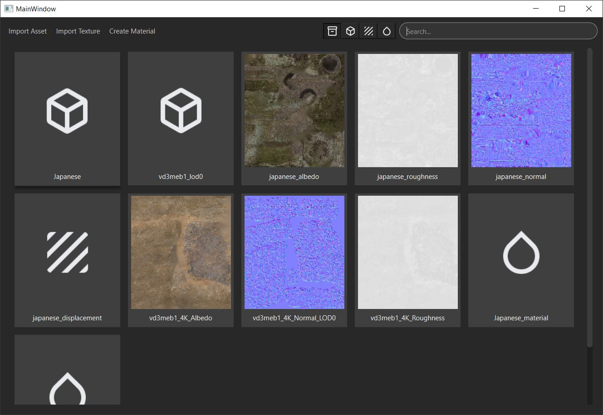
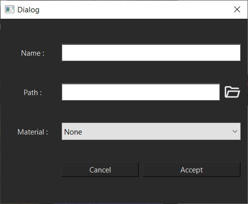
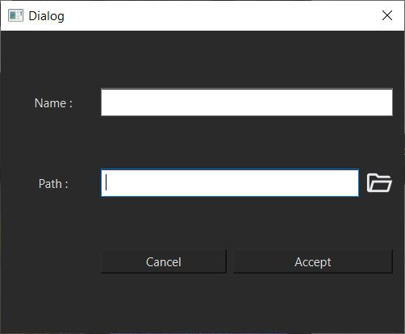
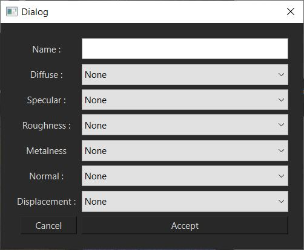

# Asset Manager

This **asset manager** can be used to store **assets** and **textures**, create **materials** and **assign** them to assets. It has a **standalone** version that is used to store files and create materials, and a **maya plugin** to import assets and textures directly to the current scene.

## Standalone App

### Interface

In the standalone app, you will find in the **top left**, the buttons to import assets and textures and a button to create materials.
In the **center**, you have a list of all assets stored (mesh, textures and materials).
In the **top right**, you can filter the list of assets (mesh, textures and materials, or everything), and a search bar to filter by name.

### Import assets

Once clicked on the **Import Asset** button. It will show a window where you can give a **name**, **path** and **material** to the asset.

### Import textures

Once clicked on the **Import Texture** button. It will show a window where you can give a **name** and to the texture.

### Note that for assets or textures, you can also drag and drop files directly into the app to import them

### Create Material

Once clicked on the **Create Material** button. It will show a window where you can give a **name** and select all the **textures** you want to add the material.

### Note that you can edit at any time any items by clicking on it